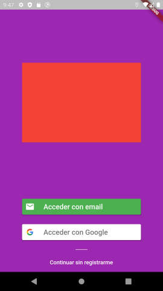
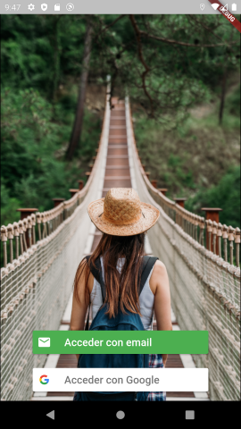
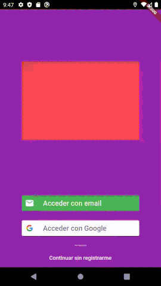

# easy_firebase_auth
Add Firebase authentication to your Flutter app with a few lines of code.

This package manages the authentication state of the app. And toggles between the different screens.

- Splash screen
- Introduction screen
- Login screen
- Home screen

You can customize every widget

This package uses [provider package](https://pub.dev/packages/provider)

### Features
- Set Splash Screen duration
- Prebuilt Widgets
- Fully customizable
- Multi-language (Prebuilt for english and spanish)
- Toggle between screens automatically

### Supported Firebase authentication methods
- Sign in with email
- Sign in with Google
- Sign in with Apple
- Sign in Anonymous
- Sign in with Facebook
- Sign in with Twitter

## Basic usage

1. [Add firebase to your flutter app](https://firebase.google.com/docs/flutter/setup)

2. Your MaterialApp must be a child of 'ChangeNotifierProvider'

```flutter
void main() => runApp(MyApp());

class MyApp extends StatelessWidget {
  @override
  Widget build(BuildContext context) {
    return ChangeNotifierProvider<AuthState>(
      child: MaterialApp(
        home: ParentPage(),
      ),
      create: (_) => AuthState(),
    );
  }
}
```

3. The AuthManagerWidget manages the screen shown in each of the authentication states

```flutter
class ParentPage extends StatelessWidget{
  @override
  Widget build(BuildContext context) {
    return AuthManagerWidget(
      splashScreen: MySplashScreen(), //optional
      introductionScreen: MyIntroductionScreen(), //optional, user not logged
      loginScreen: MyLoginScreen(), // user not logged, the introduction has been completed
      mainScreen: MyMainScreen(), // user logged (email, google, apple or anonymous)
    );
  }
}
```

## Customize your strings
You can set here your privacy url and terms of use in [markdown format](https://guides.github.com/features/mastering-markdown/)
```
AuthStrings authStrings = AuthStrings.spanish(
      privacyMarkdown: "Al continuar aceptas la [política de privacidad](https://myPrivacyUrl.com) "
          "y las [condiciones de servicio](https://myTermsUrl.com)."
    );
```

## Customize LoginScreen



```
LoginScreen(
        authStrings: authStrings,
        backgroundColor: Colors.purple,
        expandedWidget: Center(
          child: Container(
            height: 200,
            width: 300,
            color: Colors.red,
          ),
        ),
      )
```




```
LoginScreen(
        logInAnonymous: false,
        logInWithEmail: true,
        logInWithGoogle: true,
        logInWithFacebook: true,
        logInWithTwitter: true,
        logInWithApple: true,
        authStrings: authStrings,
        backgroundWidget: Image.network(imageUrl,
        fit: BoxFit.cover,),
      )
```

## Customize EmailLoginScreen



```
LoginScreen(
        ...
        emailLoginBuilder: (BuildContext context){
                  return EmailLoginScreen(
                    authStrings: authStrings,
                    appBar: AppBar(
                      title: Text("My Login"),
                    ),
                    mainColor: Colors.blue,
                  );
                },
      )
```

## Other actions

Retrieve authState from anywhere in your code

```
AuthState authState = Provider.of(context);
```

**Set introduction as completed**
```flutter
authState.setIntroductionCompleted(true);
```

**Logout** 
```flutter
authState.signOut();
```

**Change user name**
```
authState.changeName('My name');
```

**Change user photo url**
```
authState.changePhotoUrl('https://example.com/myPicture.png');
```

**Send email to reset password**
```
authState.resetPassword('userEmail@examle.com');
```

**Get user data**
```
var uid = authState.uid;
var name = authState.name;
var email = authState.email;
var photoUrl = authState.photoUrl;
var isAnonymous = authState.isAnonymous;
```

** Facebook **
Extra setup, for Android:
AndroidManifest.xml:
```
        <meta-data android:name="com.facebook.sdk.ApplicationId"
            android:value="@string/facebook_app_id"/>

        <activity android:name="com.facebook.FacebookActivity"
            android:configChanges=
                "keyboard|keyboardHidden|screenLayout|screenSize|orientation"
            android:label="@string/app_name" />
```
example strings.xml:
```
<?xml version="1.0" encoding="utf-8"?>
<resources>
    <string name="app_name">Your app name</string>

    <!-- Replace "000000000000" with your Facebook App ID here. -->
    <string name="facebook_app_id">000000000000</string>

    <!--
      Replace "000000000000" with your Facebook App ID here.
      **NOTE**: The scheme needs to start with `fb` and then your ID.
    -->
    <string name="fb_login_protocol_scheme">fb000000000000</string>

</resources>
```


